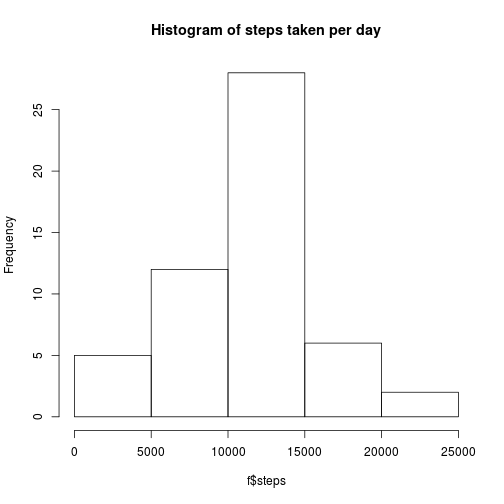
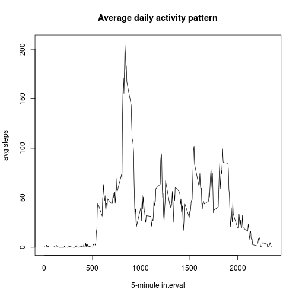
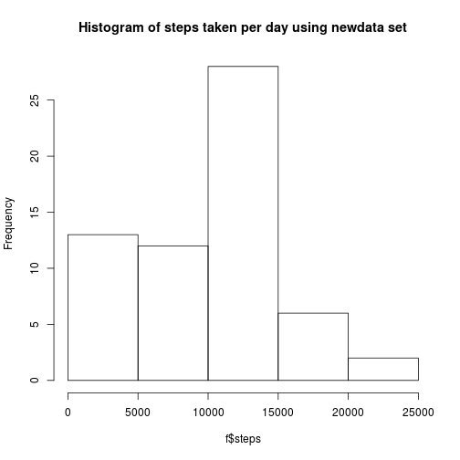
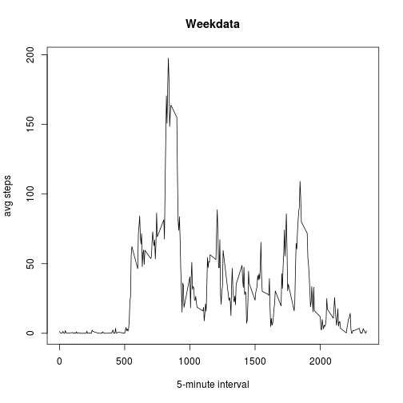
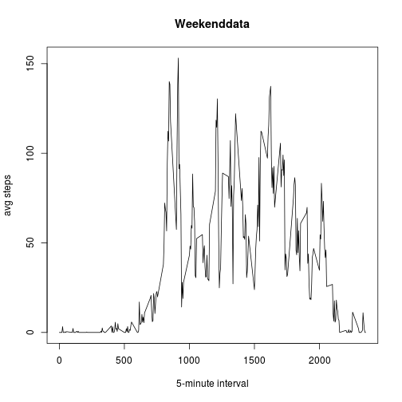

```r
opts_chunk$set(echo=TRUE)
```


```r
if(!file.exists('activity.csv')){
    unzip('activity.zip')
}
data<-read.csv("activity.csv",sep=",")
```


```r
f<-aggregate(steps ~ date, data, sum)
hist(f$steps, main="Histogram of steps taken per day")
```



```r
Mean<-mean(f$steps, na.rm=TRUE)
Median<-median(f$steps, na.rm=TRUE)
```

The mean is: 1.0766189 &times; 10<sup>4</sup> and the Meadian is: 10765  


```r
a<-aggregate(steps ~ interval, data, mean)
plot(a$interval,a$steps,xlab="5-minute interval",ylab="avg steps",type="l",main="Average daily activity pattern")
```



```r
m<-a[which.max(a$steps),]
```

The interval 835 has max avarage steps 206.1698113  


```r
s<-sum(is.na(data$steps)) 
newdata <- data
newdata[which(is.na(newdata$steps)),]$steps <- min(data$steps,na.rm=TRUE)
f<-aggregate(steps ~ date, newdata, sum)
hist(f$steps,main="Histogram of steps taken per day using newdata set")
```



```r
newmean<-mean(f$steps)
newmedian<-median(f$steps)
```

sum of NA's: 2304 
The oldmean is: 1.0766189 &times; 10<sup>4</sup> and the oldMeadian is: 10765  
NewMean: 9354.2295082 and newMedian: 10395  

replaced NA's with min value of steps column  

I see difference in mean is : 1412 and in median is: 370


```r
weekdata<-subset(newdata, weekdays(as.Date(date,format="%Y-%m-%d")) %in% c("Monday","Tuesday","Wednesday","Thrusday","Friday"),select=c(steps,date,interval))
weekenddata<-subset(newdata, weekdays(as.Date(date,format="%Y-%m-%d")) %in% c("Saturday","Sunday"),select=c(steps,date,interval))
a<-aggregate(steps ~ interval, weekdata, mean)
plot(a$interval,a$steps,xlab="5-minute interval",ylab="avg steps",type="l",main="Weekdata")
```



```r
a<-aggregate(steps ~ interval, weekenddata, mean)
plot(a$interval,a$steps,xlab="5-minute interval",ylab="avg steps",type="l",main="Weekenddata")
```



